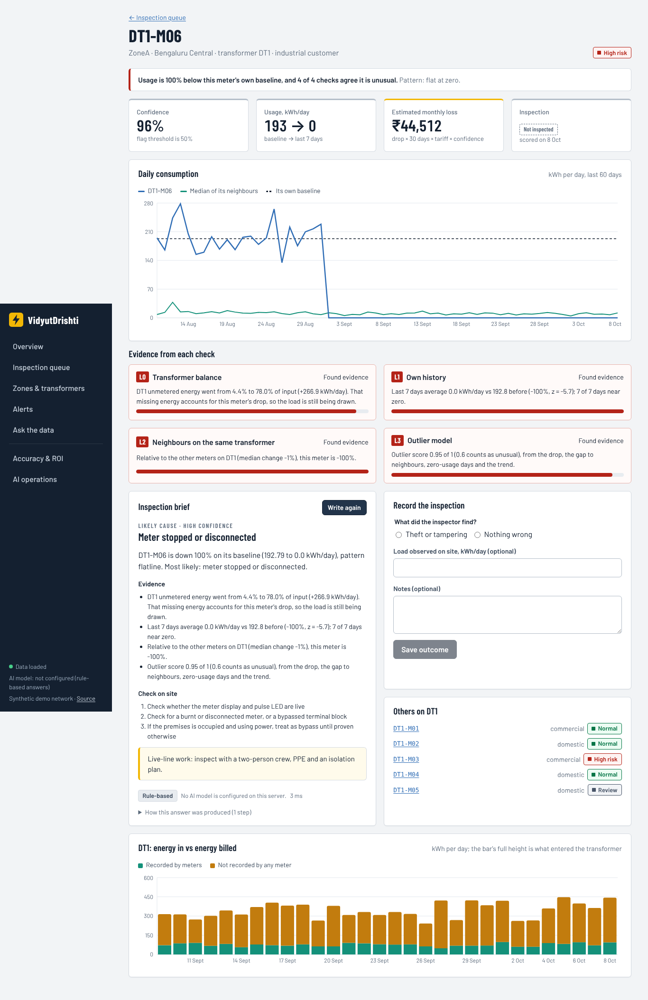
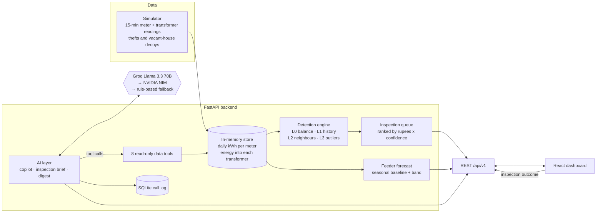
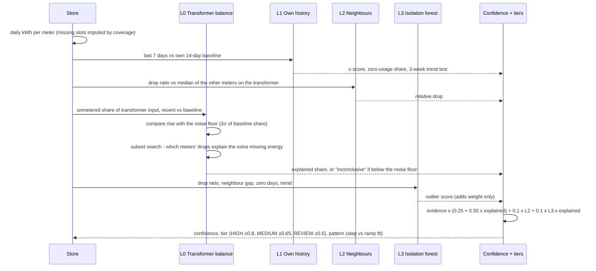
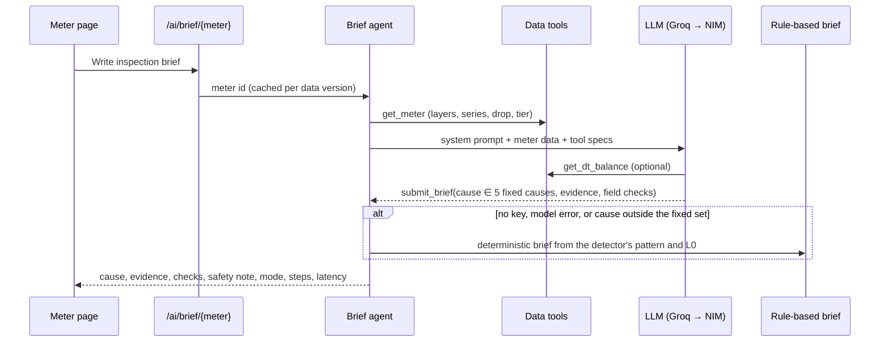
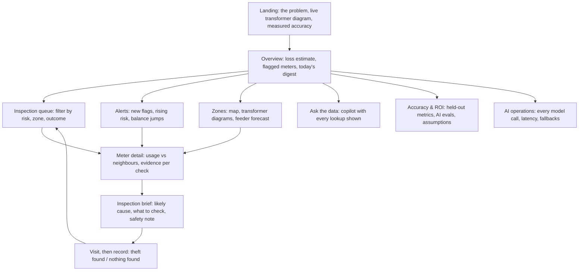
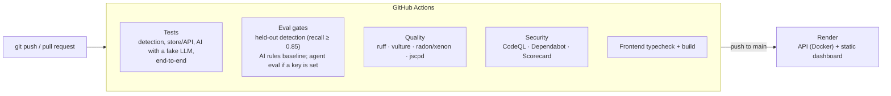

# VidyutDrishti

**Electricity-theft detection for a power distribution network.** VidyutDrishti compares the energy each transformer sends out with what its customers' meters record, checks every meter against its own history and its neighbours, and gives inspection teams a list ranked by rupees at stake, with the evidence behind every flag and an AI-written brief for the visit.

[](https://github.com/Asha0509/vidyutdrishti/actions/workflows/ci.yml)
[](https://github.com/Asha0509/vidyutdrishti/actions/workflows/quality.yml)
[](https://github.com/Asha0509/vidyutdrishti/actions/workflows/codeql.yml)
[](https://scorecard.dev/viewer/?uri=github.com/Asha0509/vidyutdrishti)

> A prototype on simulated data. The simulator has not been checked against real smart-meter data. No integration with real AMI, billing or SCADA systems, and no real consumer data.

**Contents:** [Problem](#the-problem) · [Results](#results) · [Architecture](#architecture) · [How detection works](#how-a-meter-gets-flagged) · [AI](#where-ai-is-used-and-where-it-isnt) · [Tools](#tools-and-why) · [Engineering](#engineering-quality-and-cicd) · [Run it](#run-it) · [Limits](#limits)

## The problem

Indian electricity distribution companies lose a large share of the energy they buy to aggregate technical and commercial (AT&C) losses, and theft is a big part of the commercial side: hooks on the line, bypassed or stopped meters, slow tampering. Smart meters now report every 15 minutes, but inspection teams are small. So the real question is not "is anything wrong somewhere?" but:

**"Which few meters should someone visit tomorrow, and what should they look for when they get there?"**

That sets three requirements for any detector:

1. **A flag has to usually be right.** Every false visit costs a team-day and annoys an honest customer.
2. **It has to come with a reason an inspector can check on site**, not a score from a black box.
3. **The list has to be ordered by money a visit is likely to recover**, not by how unusual a meter looks.

## What it does

| | |
|---|---|
| **Detects** | Four independent checks per meter per day, combined into a confidence score and a risk tier |
| **Ranks** | An inspection queue ordered by estimated monthly loss (drop × tariff × confidence) |
| **Explains** | Evidence from each check, an AI inspection brief (likely cause, what to check, a safety note) |
| **Alerts** | New flags, rising risk and transformers suddenly losing more energy, summarised into a morning digest |
| **Answers questions** | An analytics copilot that answers in plain language and shows every data lookup it made |
| **Forecasts** | Next-24-hour feeder demand with a confidence band, from a seasonal baseline |
| **Measures itself** | Held-out detection accuracy and AI evals, reproducible and gated in CI |



## Results

Everything here is measured, reproducible with one command, and checked in CI.

**Detection, on 20 networks the detector never saw during tuning** (thresholds were tuned on development seeds 0-19; these are seeds 1000-1019, each 8 transformers × 6 meters × 60 days with 11 random thefts and 4 vacant-house decoys):

| Metric | Held-out mean (range) |
|---|---|
| Precision: flagged meters that were thefts | **0.82** (0.71-0.92) |
| Recall: thefts that were flagged | **0.93** (0.82-1.00) |
| F1 | **0.87** (0.78-0.96) |
| Precision of the top 10 in the queue | 0.85 |
| Recall by kind: meter stopped / hook bypass / gradual tampering | 0.98 / 0.97 / 0.78 |
| Vacant houses still flagged (the main false-alarm source) | 54% |

Threshold sweep (flag threshold, precision, recall): 0.4 → 0.78 / 0.97; **0.5 → 0.82 / 0.93**; 0.6 → 0.88 / 0.85; 0.7 → 0.95 / 0.52. F1 is flat between 0.4 and 0.6; 0.5 was kept because it favours recall, the cost of a missed theft being higher than a wasted visit.

**Other results (rule-based baseline, no model key needed):**

| What | Result | Details |
|---|---|---|
| AI inspection brief, cause right | 73% of 41 meters; theft-vs-genuine right 85% | `evals/results/ai-rules.json` |
| Copilot, 30 questions | 80% answered correctly, 0 invented meter ids | `evals/results/ai-rules.json` |

**What doesn't work well yet:**

- **Vacant houses look like theft at first.** About half are still flagged; that is why every flag goes through an inspection brief and a field check before anyone is accused.
- **Gradual tampering** is caught 78% of the time but is correctly labelled as gradual only 15% of the time, so the brief usually calls it a hook bypass.
- **The simulator is idealised.** Its meters have more regular behaviour than real households, so real-world accuracy would be lower. Checking the simulator against real smart-meter data is open work.
- The agent (LLM) variants of the brief and copilot are gated in CI only when a model key is configured; no agent numbers are claimed here.

## Architecture

### High-level design



Detection is deterministic code; the language model never decides whether a meter is flagged. It only reads the same data through tools and explains it.

### Low-level design: one day of scoring



When L0 can't see the drop (below the noise floor, or no transformer data), confidence is capped at 0.75 so a meter can't reach HIGH on history alone.

### Low-level design: the AI inspection brief



### User flow



## How a meter gets flagged

Four independent checks run every day for every meter. None of them flags a meter on its own.

| Layer | What it checks | Why it's there |
|---|---|---|
| **L0 Transformer balance** | Share of transformer input that no meter recorded, last 7 days vs the 14 before. If it rose by more than the noise floor, a subset search finds which meters' drops explain the extra missing energy. Too small to see means "inconclusive", not "fine". | The physical evidence: energy that went in but wasn't billed. It also separates theft (energy still drawn) from a vacant house (energy genuinely not used). |
| **L1 Own history** | Last 7 days vs the meter's own 14-day baseline (z-score), plus a separate 3-week trend test for step-by-step tampering. | Catches sudden drops and slow declines. |
| **L2 Neighbours** | The drop relative to the median of the other meters on the same transformer. | Weather, festivals and outages hit neighbours too, so they cancel out. |
| **L3 Outlier model** | Isolation forest over drop ratio, gap to neighbours, zero-usage days and trend. | Catches combinations the rules miss; adds weight only. |

A meter is flagged at confidence **0.50** and tiered HIGH (≥ 0.80), MEDIUM (≥ 0.65) or REVIEW (≥ 0.50). The queue is ordered by estimated monthly loss: drop × 30 days × tariff (₹6 domestic, ₹8 industrial, ₹9 commercial per kWh, assumed) × confidence. A pattern label (flat at zero, sudden drop, gradual decline) comes from fitting a step vs a ramp to the series.

## Where AI is used, and where it isn't

| Task | Approach | Why |
|---|---|---|
| Deciding whether a meter is suspicious | **Deterministic rules + a small statistical model** | Must be testable, explainable and stable; an LLM adds cost and variance and can't be evaluated meter by meter as cleanly. |
| Choosing the likely cause and writing the brief | **LLM agent with tools**, constrained to 5 fixed causes, rule-based fallback | Turning layer evidence into an inspector's plan is language work; the fixed cause set keeps it checkable against ground truth. |
| Answering questions about the network | **LLM agent with 8 read-only tools** | Every number comes from a tool call, and the steps are shown, so answers can be audited. |
| Morning digest | **Rules find alerts, LLM summarises** | Rules decide what is alert-worthy; the model only writes the summary. |

Models: Groq `llama-3.3-70b-versatile` first, NVIDIA NIM `meta/llama-3.1-70b-instruct` as fallback, then a rule-based answer, so the app works with no key at all and says which path answered. Every model call is logged to SQLite (latency, tokens, tool calls, failovers, fallback reason) and shown on the AI operations page; AI endpoints are rate-limited per visitor when a key is set.

**AI evals** (`python evals/ai_eval.py --mode rules|agent`) run on unseen networks: brief causes are checked against the simulator's ground truth, and copilot answers against values computed from the same data, with a check for invented meter ids. The rule-based baseline: cause right 73%, theft-vs-genuine right 85%, copilot 80% right with no invented meters. The agent run needs a model key and runs in CI when one is configured.

## Tools and why

| Tool | Used for | Why this one |
|---|---|---|
| **FastAPI + Pydantic** | REST API, request validation | Async, typed, OpenAPI docs at `/docs` for free |
| **pandas, NumPy** | Daily aggregation, scoring | The detection maths is column-wise over meters × days |
| **scikit-learn** | Isolation forest (L3) | Standard, well-understood, no GPU |
| **Groq (Llama 3.3 70B)** | Copilot, briefs, digest | Fast hosted inference with OpenAI-style tool calling |
| **NVIDIA NIM (Llama 3.1 70B)** | LLM fallback | Second provider so one outage doesn't break the AI features |
| **SQLite** | AI call log | Zero-ops, good enough for one instance |
| **React, TypeScript, Vite** | Dashboard | Typed UI, fast builds |
| **TanStack Query** | Data fetching | Caching, retries and loading states without hand-written state |
| **Recharts, Leaflet** | Charts, zone map | Composable charts; open map tiles |
| **pytest, ruff, vulture, radon, jscpd** | Tests, lint, dead code, complexity, duplication | Enforced in CI (below) |
| **GitHub Actions, CodeQL, Dependabot, OpenSSF Scorecard** | CI/CD, security scanning, dependency updates | Every push is tested, evaluated and scanned |
| **Docker, Render** | Packaging, hosting | One image for the API; Render deploys from `main` on push, alongside CI |

## Engineering quality and CI/CD



- **Tests** run with a fake LLM transport, so CI never calls a model unless a key secret is configured.
- **Eval gates:** CI regenerates the held-out detection eval and fails if recall drops below 0.85.
- **Quality:** ruff, dead-code detection (vulture) and duplication (jscpd) fail the build. Complexity (radon/xenon) is reported and gated loosely: several functions (`alerts`, the observability `summary`, `score_meters`) are above the target and are scheduled for a refactor.
- **Prototype modules** from the original feature-by-feature build (DB ingestion, earlier per-layer detectors, risk and feedback models) are not imported by the API and are excluded from lint; see [Limits](#limits).

## Run it

**Quick demo (no database):**

```bash
cd backend && pip install -e .
DEMO_SEED=1 DB_NAME=x DB_USER=x DB_PASSWORD=x uvicorn app.main:app --port 8000
# in another terminal
cd frontend && npm install && VITE_API_BASE=http://localhost:8000 npm run dev
```

`DEMO_SEED=1` generates the 60-day demo network in memory on startup. Add `GROQ_API_KEY` and/or `NVIDIA_NIM_API_KEY` to turn on the model-backed AI paths.

**Docker:** `cp infra/.env.sample infra/.env && docker compose up --build` (dashboard on :5173, API docs on :8000/docs). The compose file also starts TimescaleDB, which the prototype ingestion CLI (`python -m app.ingestion.cli`) can load simulator CSVs into; the API itself serves from memory.

**Tests and evals:**

```bash
cd backend && pytest                                  # unit, API and AI tests
pytest tests/e2e                                      # end-to-end tests (from the repo root)
python evals/detection_eval.py                        # held-out detection metrics
python evals/ai_eval.py --mode rules                  # AI baseline (--mode agent needs a key)
```

| Environment variable | Purpose |
|---|---|
| `DEMO_SEED` | `1` loads the synthetic demo network on startup |
| `CORS_ORIGINS` | Comma-separated frontend origins |
| `GROQ_API_KEY`, `GROQ_MODEL` | Primary model for the AI features |
| `NVIDIA_NIM_API_KEY`, `NVIDIA_NIM_MODEL` | Fallback model |
| `OBS_DB_PATH` | Where the AI call log is written |
| `VITE_API_BASE` | Backend URL, set when building the frontend |

## Repository

```
backend/app/detection/scoring.py   the four layers, confidence, tiers, queue ranking
backend/app/ai/                    LLM client, data tools, copilot and brief agents, alerts, call log
backend/app/forecast/engine.py     seasonal-baseline feeder forecast with bands
backend/app/api/                   REST endpoints (/api/v1 and /api/v1/ai)
backend/tests/                     unit and API tests
simulator/                         synthetic network, thefts, decoys
evals/                             detection and AI evals; results in evals/results
frontend/                          React dashboard
logs/                              per-feature notes and tests from the original build
```

## Limits

- **Simulated data.** No public dataset labels theft at this granularity, so theft patterns are modelled, and the simulator has not been compared with real smart-meter data. Treat the accuracy figures as method validation, not field performance.
- **Rupee figures** use flat assumed tariffs and the ROI page rests on stated assumptions, not billing data.
- **Inspection outcomes** are recorded and shown, but don't retrain the thresholds yet.
- **The forecast** is a seasonal baseline with a confidence band; it has not been benchmarked against alternatives here.
- **The API keeps data in memory.** TimescaleDB and the ingestion CLI come from the original prototype and aren't wired into the API; the same goes for the earlier per-layer detector modules in `backend/app`.
- **Complexity:** a few long functions are reported in CI and due for a refactor.

Synthetic data only. No real consumer information is committed to this repository.
