# VidyutDrishti

**Electricity-theft detection for a power distribution network.** VidyutDrishti compares the energy each transformer sends out with what its customers' meters record, checks every meter against its own history and its neighbours, and gives inspection teams a list ranked by rupees at stake, with the evidence behind every flag and an AI-written brief for the visit.

[](https://github.com/Asha0509/vidyutdrishti/actions/workflows/ci.yml)
[](https://github.com/Asha0509/vidyutdrishti/actions/workflows/quality.yml)
[](https://github.com/Asha0509/vidyutdrishti/actions/workflows/codeql.yml)
[](https://scorecard.dev/viewer/?uri=github.com/Asha0509/vidyutdrishti)

> A prototype on simulated data. The simulator has been compared with real London smart-meter households (see [docs/SIMULATOR_REALISM.md](docs/SIMULATOR_REALISM.md)) but is still separable from real data. No integration with real AMI, billing or SCADA systems, and no real consumer data.

**Contents:** [Problem](#problem-statement) · [Solution](#solution) · [File structure](#file-structure) · [User flow](#user-flow) · [LLD](#low-level-design-lld) · [HLD](#high-level-design-hld) · [Scaling](#how-it-would-scale) · [USP](#usp-what-is-different-and-why-it-is-better) · [Tools](#tools-and-software-used) · [Principles](#principles-used) · [Requirements](#functional-and-non-functional-requirements) · [Results](#results) · [CI/CD](#engineering-quality-and-cicd) · [Run it](#run-it) · [Limits](#limits)

## Problem statement

Indian electricity distribution companies lose a large share of the energy they buy to aggregate technical and commercial (AT&C) losses, and theft is a big part of the commercial side: hooks on the line, bypassed or stopped meters, slow tampering. Smart meters now report every 15 minutes, but inspection teams are small. So the real question is not "is anything wrong somewhere?" but:

**"Which few meters should someone visit tomorrow, and what should they look for when they get there?"**

That sets three requirements for any detector:

1. **A flag has to usually be right.** Every false visit costs a team-day and annoys an honest customer.
2. **It has to come with a reason an inspector can check on site**, not a score from a black box.
3. **The list has to be ordered by money a visit is likely to recover**, not by how unusual a meter looks.

## Solution

VidyutDrishti scores every meter every day with four independent checks and turns the result into a work list.

1. **Ingest** 15-minute meter and transformer readings (from the built-in simulator in this prototype).
2. **Check the physics (L0).** Compare what each distribution transformer sent out with what its meters recorded. A rising unexplained gap points at theft; a subset search finds which meters' drops explain it.
3. **Check each meter against itself (L1)** and **against its neighbours (L2)**, so weather, festivals and outages cancel out.
4. **Add an outlier model (L3)** (isolation forest) that adds weight but cannot flag a meter alone.
5. **Combine into a confidence score and tier** (HIGH, MEDIUM, REVIEW). Without transformer-balance evidence the confidence is capped.
6. **Rank by rupees at stake**: drop x 30 days x tariff x confidence.
7. **Explain and assist.** Each flag shows its evidence and a brief of the likely cause and what to check; a copilot answers questions with every data lookup shown; an alert digest summarises what changed; the next 24 hours of feeder demand are forecast with a band.
8. **Measure itself.** Held-out detection and AI evals run in CI.

## Screenshots

Taken from the live deployment, on the synthetic demo network.


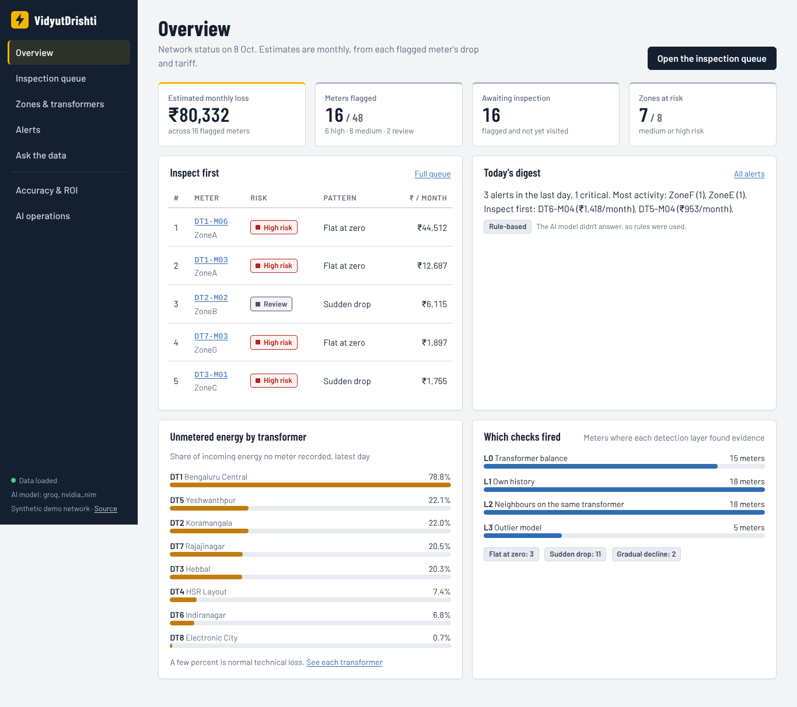
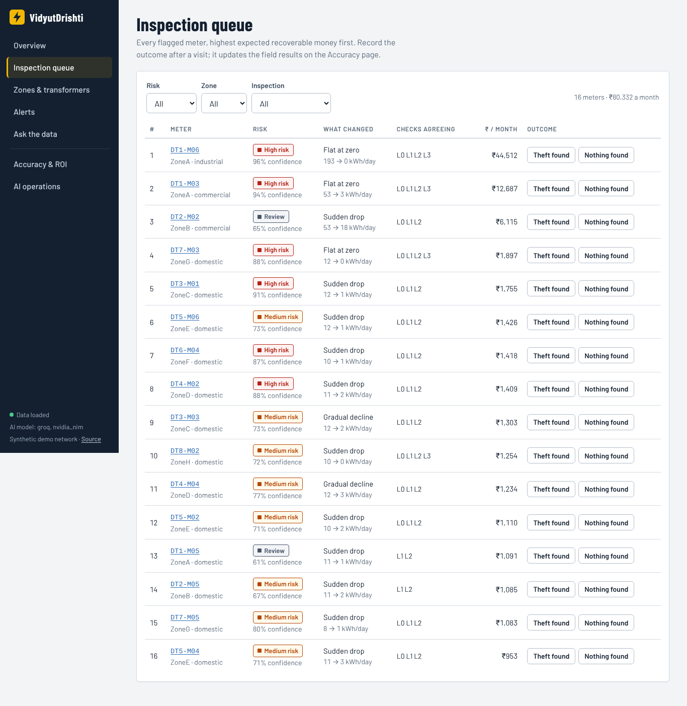
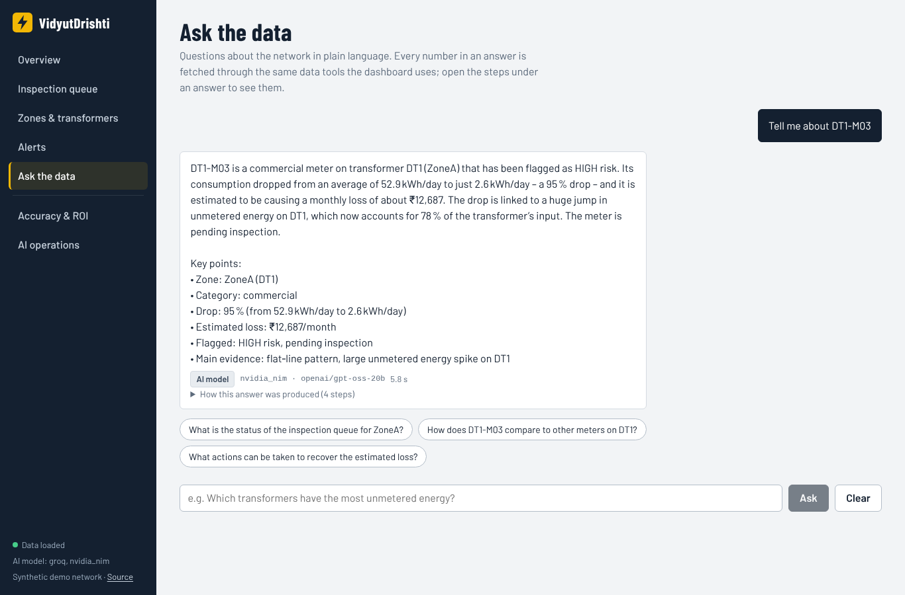

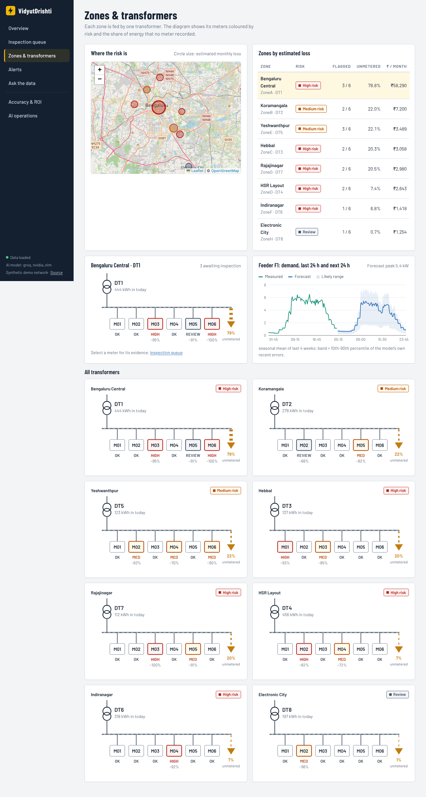
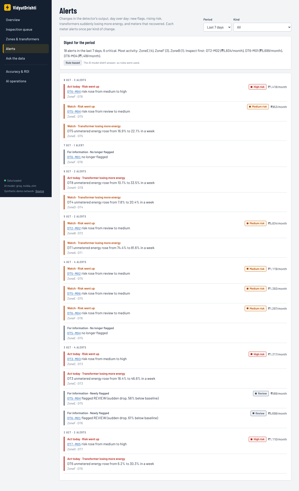
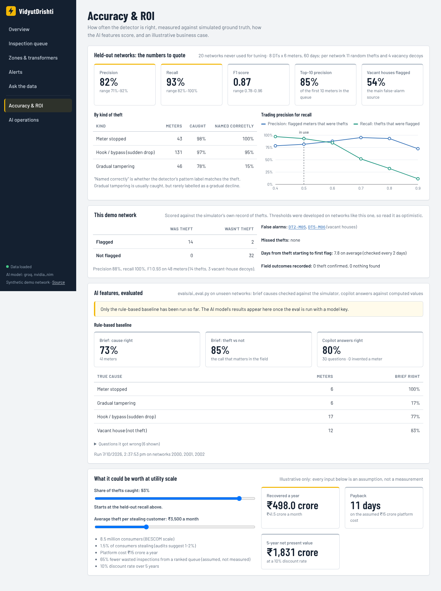
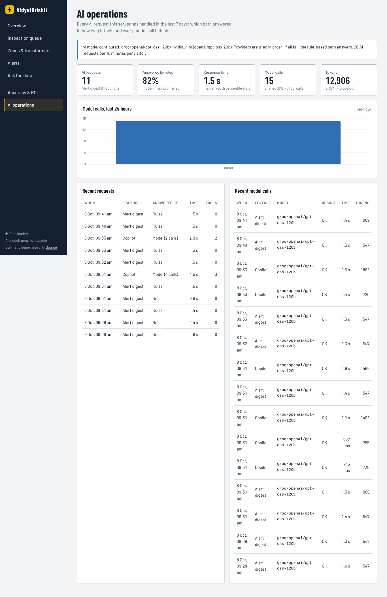

## File structure

```
.github/workflows/    ci.yml (tests + eval gates), quality.yml (ruff, vulture, xenon, jscpd), codeql.yml, scorecard.yml; dependabot.yml
render.yaml           Render blueprint: API + static dashboard, deploy only after checks pass
ruff.toml             One lint config (prototype modules excluded)
scripts/validate.sh   One-command validation: lint, tests, held-out detection gate, AI eval, frontend build (--full adds real-data checks)
Makefile, docker-compose.yml, infra/   Local Docker setup (API, dashboard, TimescaleDB for the prototype ingestion)

backend/app/
  main.py                    FastAPI entry point, CORS, startup demo seeding
  config.py                  Runtime settings from environment variables
  store.py                   In-memory store: readings, topology, queue, feedback, evaluation
  demo_seed.py               Generates the 60-day demo network at startup
  api/routes.py              REST API: overview, queue, meters, zones, transformer balance, feedback, forecast, evaluation, ROI
  api/ai.py                  AI endpoints: copilot, brief, alerts, digest, ops views, evals
  detection/scoring.py       The live detector: four layers, confidence, tiers, ranking, pattern label
  detection/layer0..3_*.py, classifier.py, confidence.py   Earlier per-layer prototype modules (not used by the API)
  ai/agents.py               Tool-calling copilot and inspection-brief agents with rule-based fallback
  ai/tools.py                Eight read-only data tools; every number the agents give comes from them
  ai/llm.py                  Shared client: Groq, then NVIDIA NIM, then rules
  mcp_server.py              MCP server: the same 8 read-only tools over the Model Context Protocol (stdio)
  ai/alerts.py               Rules over day-to-day changes; the model only writes the summary
  ai/observability.py        SQLite log of every model call and run
  forecast/engine.py         4-week seasonal-mean feeder forecast with error-based band (optional Chronos-Bolt)
  evaluation/live.py         Measured detection metrics against the simulator's ground truth
  ingestion/, db/, features/, forecasting/ (Prophet), risk/, feedback/, inspection/, audit/   Prototype modules from the first build; not wired into the API
backend/tests/              Detection, store/API, AI (fake LLM), forecast, realism-config, MCP server tests

simulator/
  dataset.py, load_model.py, scenarios.py, models.py, generate.py, calibrated_realism.json
                            Synthetic network, load shapes, theft and decoy injection, realism knobs calibrated on real households

evals/
  detection_eval.py         Held-out detection on unseen networks (gated)
  ai_eval.py                Brief and copilot evals against ground truth
  real_data.py, realism_eval.py, calibrate_simulator.py   Compare and calibrate the simulator against real London households
  forecast_benchmark.py     Forecast benchmark on real data
  results/                  Published JSON results

tests/e2e/                  End-to-end test through the API
docs/                       SIMULATOR_REALISM.md, FORECAST_BENCHMARK.md, images
db/migrations/, db/seed/    TimescaleDB schema and tariff/holiday seeds (prototype)
logs/                       Per-feature build notes and tests from the original build

frontend/src/
  App.tsx, main.tsx, api.ts, styles.css   Routing, API client
  pages/    Landing, Dashboard, Queue, Meter, Zones (map + forecast), Alerts, Copilot, Quality (measured accuracy), Ops (AI calls)
  components/  DTDiagram (transformer view), Trace (agent steps), ui
  lib/      queries (TanStack Query), types, format
```

## User flow

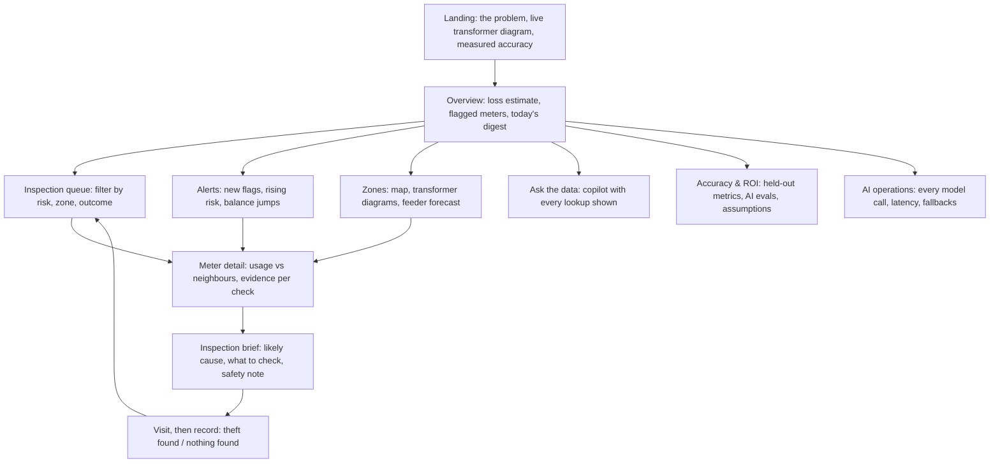

**Explanation.** An inspector opens the dashboard and sees the day's ranked queue. Opening a meter shows its usage against neighbours and baseline, the evidence from each check and a brief of the likely cause. After the visit the outcome is recorded as feedback. Managers use the zone view for transformer losses and the forecast, the copilot for questions, and the Quality and Ops pages to see how well the system is doing.

## Low-level design (LLD)

### One day of scoring

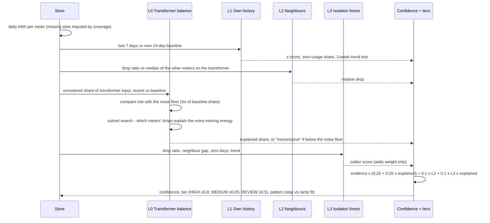

### The AI inspection brief

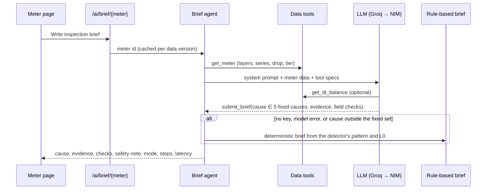

**Explanation.** `scoring.py` builds a meters x days matrix, runs the four layers over a recent window, combines them in the confidence step and ranks by estimated money. The brief agent calls read-only tools, must choose one of five fixed causes, and falls back to rules if no model is available; the fixed cause set is what lets it be scored against ground truth.

### How a meter gets flagged

Four independent checks run every day for every meter. None of them flags a meter on its own.

| Layer | What it checks | Why it's there |
|---|---|---|
| **L0 Transformer balance** | Share of transformer input that no meter recorded, last 7 days vs the 14 before. If it rose by more than the noise floor, a subset search finds which meters' drops explain the extra missing energy. Too small to see means "inconclusive", not "fine". | The physical evidence: energy that went in but wasn't billed. It also separates theft (energy still drawn) from a vacant house (energy genuinely not used). |
| **L1 Own history** | Last 7 days vs the meter's own 14-day baseline (z-score), plus a separate 3-week trend test for step-by-step tampering. | Catches sudden drops and slow declines. |
| **L2 Neighbours** | The drop relative to the median of the other meters on the same transformer. | Weather, festivals and outages hit neighbours too, so they cancel out. |
| **L3 Outlier model** | Isolation forest over drop ratio, gap to neighbours, zero-usage days and trend. | Catches combinations the rules miss; adds weight only. |

A meter is flagged at confidence **0.50** and tiered HIGH (≥ 0.80), MEDIUM (≥ 0.65) or REVIEW (≥ 0.50). The queue is ordered by estimated monthly loss: drop × 30 days × tariff (₹6 domestic, ₹8 industrial, ₹9 commercial per kWh, assumed) × confidence. A pattern label (flat at zero, sudden drop, gradual decline) comes from fitting a step vs a ramp to the series.

### Where AI is used, and where it isn't

| Task | Approach | Why |
|---|---|---|
| Deciding whether a meter is suspicious | **Deterministic rules + a small statistical model** | Must be testable, explainable and stable; an LLM adds cost and variance and can't be evaluated meter by meter as cleanly. |
| Choosing the likely cause and writing the brief | **LLM agent with tools**, constrained to 5 fixed causes, rule-based fallback | Turning layer evidence into an inspector's plan is language work; the fixed cause set keeps it checkable against ground truth. |
| Answering questions about the network | **LLM agent with 8 read-only tools** | Every number comes from a tool call, and the steps are shown, so answers can be audited. |
| Morning digest | **Rules find alerts, LLM summarises** | Rules decide what is alert-worthy; the model only writes the summary. |

Models: Groq `openai/gpt-oss-120b` first, NVIDIA NIM `openai/gpt-oss-20b` as fallback, then a rule-based answer, so the app works with no key at all and says which path answered. Every model call is logged to SQLite (latency, tokens, tool calls, failovers, fallback reason) and shown on the AI operations page; AI endpoints are rate-limited per visitor when a key is set.

**AI evals** (`python evals/ai_eval.py --mode rules|agent`) run on unseen networks: brief causes are checked against the simulator's ground truth, and copilot answers against values computed from the same data, with a check for invented meter ids. The rule-based baseline: cause right 73%, theft-vs-genuine right 85%, copilot 80% right with no invented meters. The agent run needs a model key and runs in CI when one is configured.

## High-level design (HLD)

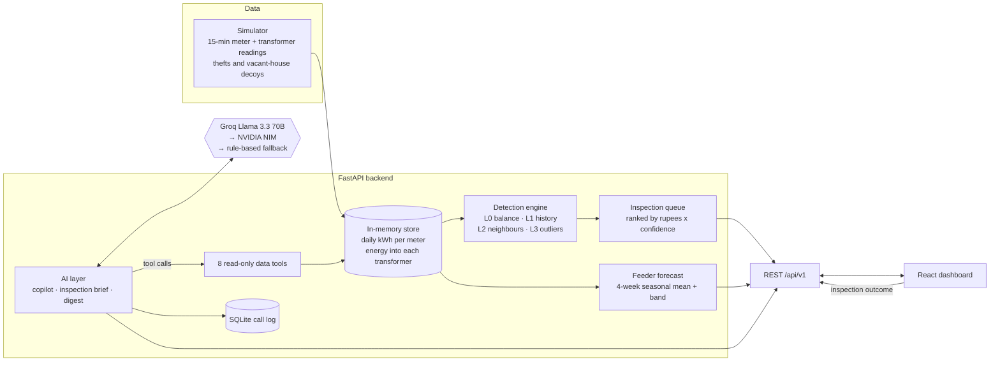

**Explanation.** Simulated meter and transformer readings feed a stateless FastAPI service that scores, ranks, forecasts and serves AI features from an in-memory store. A React dashboard reads the API. Two LLM providers back the AI paths with a rule-based fallback, and SQLite logs model calls. GitHub Actions gates every push and Render deploys `main` after checks pass.

## How it would scale

| Concern | Today | Next step |
|---|---|---|
| Ingestion | Simulator data loaded in memory | Real AMI feeds through the ingestion pipeline already sketched (readers, quality gate, imputer, idempotent loader) into TimescaleDB, which the schema and migrations already describe |
| Storage | In-memory store, one instance | Time-series database for readings, Postgres for queue and feedback; the API reads from them instead of memory |
| Compute | Daily scoring of ~50 meters in one process | Score per transformer in parallel workers (the layers are per-transformer); incremental daily updates instead of recomputing the window |
| Forecasting | 4-week seasonal mean per feeder | Chronos-Bolt served through ONNX or a separate small service (about 10% better MASE in the benchmark), plus weather and holiday inputs |
| Learning | Feedback is recorded, thresholds do not retrain | Use inspection outcomes to retune thresholds and measure precision on real visits |
| Realism | Simulator calibrated on London households | Calibrate on utility data and validate against confirmed theft cases |
| AI | Two providers with fallback | Cache briefs, rate-limit by user, add provider budget alerts |
| Operations | Ops page over SQLite | Metrics and traces to a standard collector with alerts on drift in flag rate and precision |

## USP: what is different and why it is better

| Feature | Common approach | What this does |
|---|---|---|
| Evidence | A theft-probability score per meter | Four independent checks; no single one can flag a meter, and each shows its evidence |
| Physical grounding | Statistics on the meter alone | L0 compares transformer input with metered output, separating theft from a genuinely vacant house, and says "inconclusive" when the signal is below the noise floor |
| Ranking | By anomaly score | By estimated rupees recoverable (drop x tariff x confidence), so teams visit the most valuable meters first |
| Honest confidence | Scores that look certain | Confidence capped at 0.75 without transformer-balance evidence |
| AI use | An LLM decides | Detection is deterministic and testable; the model writes the brief and answers questions, constrained to fixed causes and read-only tools, with a rule-based fallback |
| Auditability | Chat answers | The copilot shows every data lookup; invented meter ids are counted as errors (0 in the baseline eval) |
| Measured quality | Demo screenshots | Held-out detection (20 unseen networks), AI evals, a real-data realism check and a forecast benchmark, gated in CI |
| Candour | Hidden weak spots | "What doesn't work well yet" is published: vacant-house false alarms, gradual-tampering labels, simulator gap |

## Tools and software used

| Tool | Used for | Why this one |
|---|---|---|
| **FastAPI + Pydantic** | REST API, request validation | Async, typed, OpenAPI docs at `/docs` for free |
| **pandas, NumPy** | Daily aggregation, scoring | The detection maths is column-wise over meters × days |
| **scikit-learn** | Isolation forest (L3) | Standard, well-understood, no GPU |
| **Groq (Llama 3.3 70B)** | Copilot, briefs, digest | Fast hosted inference with OpenAI-style tool calling |
| **NVIDIA NIM (Llama 3.1 70B)** | LLM fallback | Second provider so one outage doesn't break the AI features |
| **SQLite** | AI call log | Zero-ops, good enough for one instance |
| **React, TypeScript, Vite** | Dashboard | Typed UI, fast builds |
| **TanStack Query** | Data fetching | Caching, retries and loading states without hand-written state |
| **Recharts, Leaflet** | Charts, zone map | Composable charts; open map tiles |
| **pytest, ruff, vulture, radon, jscpd** | Tests, lint, dead code, complexity, duplication | Enforced in CI (below) |
| **GitHub Actions, CodeQL, Dependabot, OpenSSF Scorecard** | CI/CD, security scanning, dependency updates | Every push is tested, evaluated and scanned |
| **Docker, Render** | Packaging, hosting | One image for the API; Render deploys from `main` on push, alongside CI |
| **Model Context Protocol (`mcp`)** | Serves the copilot's data tools to any MCP client | Open standard; reuses the existing tools with no new logic |
| **SDMetrics, Chronos-Bolt (optional)** | Simulator realism scoring, benchmark comparator | Standard realism metrics; a strong pretrained forecaster to measure the simple model against |

## Principles used

* **Deterministic first, models where language helps.** Detection is rules plus a small statistical model; LLMs write and answer.
* **Evidence over scores.** Every flag carries what each layer saw.
* **Never claim more than was measured.** Held-out seeds are separate from tuning seeds; limits are published.
* **Fail soft.** Provider failure falls back to rules and the response says which path answered.
* **Explain money, not just anomalies.** The queue is ordered by expected recovery.
* **Test without the network.** A fake LLM transport keeps CI deterministic.
* **Keep experiments honest.** A reworked shape classifier that scored worse was dropped, not shipped.
* **Single source of truth.** Tariffs, thresholds and tiers live in one scoring module.

## Functional and non-functional requirements

**Functional**

| Requirement | How it is implemented |
|---|---|
| Detect likely theft per meter per day | `detection/scoring.py`, four layers, threshold 0.50 |
| Rank inspections by value | Monthly loss estimate x confidence; `/queue/daily` |
| Explain each flag | Layer evidence on the meter page; inspection brief agent |
| Answer questions about the network | Copilot with eight read-only tools and visible steps |
| Alert on changes | `ai/alerts.py` rules plus a model-written digest |
| Forecast feeder demand | `forecast/engine.py`, 24 h with band |
| Record inspection outcomes | `/feedback`, shown on the queue and in field metrics |
| Show measured quality | `/metrics/evaluation`, Quality page |

**Non-functional**

| Quality | Target | How it is implemented and checked |
|---|---|---|
| Accuracy | Few wasted visits, few missed thefts | Held-out P 0.82 / R 0.93; recall gated at 0.85 in CI |
| Explainability | Inspector can check a flag on site | Per-layer evidence, shown agent steps |
| Reliability | App works with no model key | Provider failover then rules; response states the path used |
| Observability | Every model call visible | SQLite call log, Ops page (latency, tokens, tool calls, fallbacks) |
| Testability | Reproducible | Fixed seeds, fake LLM transport, end-to-end tests, 34 backend tests |
| Maintainability | Small, clean code | ruff, vulture (dead code), radon/xenon (complexity), jscpd (duplication) in CI. Prototype modules are listed and excluded rather than hidden. A Ponytail minimal-code review pass is planned and has not been run yet |
| Security | No secrets in code, scanned | Env-only keys, CodeQL, OpenSSF Scorecard, Dependabot, per-visitor rate limits on AI endpoints |
| Performance | Runs on a small server | Pandas/NumPy scoring in memory; heavy models are opt-in |
| Data validity | Know how far the simulator is from reality | Real-data realism check (quality 61% to 84%, still separable) |
| Portability | Local, Docker or Render | Compose file, Dockerfiles, `render.yaml` |

## Results

Everything here is measured, reproducible with one command, and checked in CI.

**Detection, on 20 networks the detector never saw during tuning** (thresholds were tuned on development seeds 0-19; these are seeds 1000-1019, each 8 transformers × 6 meters × 60 days with 11 random thefts and 4 vacant-house decoys):

| Metric | Held-out mean (range) |
|---|---|
| Precision: flagged meters that were thefts | **0.82** (0.71-0.92) |
| Recall: thefts that were flagged | **0.93** (0.82-1.00) |
| F1 | **0.87** (0.78-0.96) |
| Precision of the top 10 in the queue | 0.85 |
| Recall by kind: meter stopped / hook bypass / gradual tampering | 0.98 / 0.97 / 0.78 |
| Vacant houses still flagged (the main false-alarm source) | 54% |

Threshold sweep (flag threshold, precision, recall): 0.4 → 0.78 / 0.97; **0.5 → 0.82 / 0.93**; 0.6 → 0.88 / 0.85; 0.7 → 0.95 / 0.52. F1 is flat between 0.4 and 0.6; 0.5 was kept because it favours recall, the cost of a missed theft being higher than a wasted visit.

**Other results (rule-based baseline, no model key needed):**

| What | Result | Details |
|---|---|---|
| AI inspection brief, cause right | 73% of 41 meters; theft-vs-genuine right 85% | `evals/results/ai-rules.json` |
| Copilot, 30 questions | 80% answered correctly, 0 invented meter ids | `evals/results/ai-rules.json` |

**What doesn't work well yet:**

- **Vacant houses look like theft at first.** About half are still flagged; that is why every flag goes through an inspection brief and a field check before anyone is accused.
- **Gradual tampering** is caught 78% of the time but is correctly labelled as gradual only 15% of the time, so the brief usually calls it a hook bypass.
- **The simulator is idealised.** Its meters are more regular than real households, so real-world accuracy would be lower. On a simulator calibrated to real London households, development-seed F1 falls to 0.79 (recall 0.84); gradual tampering is the weakest case (recall 0.63). The headline held-out numbers above use the original simulator.
- The agent (LLM) variants of the brief and copilot are gated in CI only when a model key is configured; no agent numbers are claimed here.

## Engineering quality and CI/CD

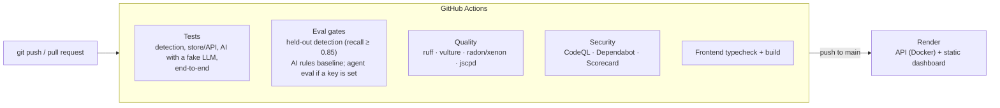

- **Tests** run with a fake LLM transport, so CI never calls a model unless a key secret is configured.
- **Eval gates:** CI regenerates the held-out detection eval and fails if recall drops below 0.85.
- **Quality:** ruff, dead-code detection (vulture) and duplication (jscpd) fail the build. Complexity (radon/xenon) is reported and gated loosely: several functions (`alerts`, the observability `summary`, `score_meters`) are above the target and are scheduled for a refactor.
- **Prototype modules** from the original feature-by-feature build (DB ingestion, earlier per-layer detectors, risk and feedback models) are not imported by the API and are excluded from lint; see [Limits](#limits).

### Validate and deploy

`scripts/validate.sh` runs the whole pipeline in order and prints a pass/fail line per stage: lint, backend tests, end-to-end tests, the held-out detection gate (recall >= 0.85 on 20 unseen networks), the AI eval and the frontend build; `--full` also re-runs the real-data realism check and the forecast benchmark. It is the same set of checks CI runs, so a green local run predicts a green build.

`render.yaml` is a Render blueprint with `autoDeployTrigger: checksPass`: a push to `main` deploys only after the GitHub checks pass. Secrets are declared with `sync: false` and entered in the Render dashboard, never committed.

### MCP server

The copilot's eight read-only data tools are also served over the [Model Context Protocol](https://modelcontextprotocol.io), so any MCP client (an IDE, a desktop assistant, another agent) can query the network without going through the dashboard. It reuses `app/ai/tools.py` unchanged, so tool names, arguments and descriptions are identical to what the in-app copilot sees, and nothing it exposes can write data or change a decision.

```bash
pip install -e "backend[mcp]"
cd backend && python -m app.mcp_server        # seeds the demo network, then serves over stdio
```

Client configuration (for example a desktop assistant's MCP settings):

```json
{ "mcpServers": { "vidyutdrishti": { "command": "python", "args": ["-m", "app.mcp_server"], "cwd": "/path/to/vidyutdrishti/backend" } } }
```

Tools: `get_overview`, `list_zones`, `get_queue`, `find_meters`, `get_meter`, `get_dt_balance`, `detection_quality`, `get_alerts`. Tested by listing the tools through the server and by an end-to-end stdio session against the seeded demo network.

## Run it

**Quick demo (no database):**

```bash
cd backend && pip install -e .
DEMO_SEED=1 DB_NAME=x DB_USER=x DB_PASSWORD=x uvicorn app.main:app --port 8000
# in another terminal
cd frontend && npm install && VITE_API_BASE=http://localhost:8000 npm run dev
```

`DEMO_SEED=1` generates the 60-day demo network in memory on startup. Add `GROQ_API_KEY` and/or `NVIDIA_NIM_API_KEY` to turn on the model-backed AI paths.

**Docker:** `cp infra/.env.sample infra/.env && docker compose up --build` (dashboard on :5173, API docs on :8000/docs). The compose file also starts TimescaleDB, which the prototype ingestion CLI (`python -m app.ingestion.cli`) can load simulator CSVs into; the API itself serves from memory.

**Tests and evals:**

```bash
cd backend && pytest                                  # unit, API and AI tests
pytest tests/e2e                                      # end-to-end tests (from the repo root)
python evals/detection_eval.py                        # held-out detection metrics
python evals/ai_eval.py --mode rules                  # AI baseline (--mode agent needs a key)
```

| Environment variable | Purpose |
|---|---|
| `DEMO_SEED` | `1` loads the synthetic demo network on startup |
| `CORS_ORIGINS` | Comma-separated frontend origins |
| `GROQ_API_KEY`, `GROQ_MODEL` | Primary model for the AI features |
| `NVIDIA_NIM_API_KEY`, `NVIDIA_NIM_MODEL` | Fallback model |
| `OBS_DB_PATH` | Where the AI call log is written |
| `VITE_API_BASE` | Backend URL, set when building the frontend |

## Limits

- **Simulated data.** No public dataset labels theft at this granularity, so theft patterns are modelled, and although the simulator has been compared with real London households (quality score 61% to 84% after calibration, but still separable from real data; see [docs/SIMULATOR_REALISM.md](docs/SIMULATOR_REALISM.md)), no real theft data was available. Treat the accuracy figures as method validation, not field performance.
- **Rupee figures** use flat assumed tariffs and the ROI page rests on stated assumptions, not billing data.
- **Inspection outcomes** are recorded and shown, but don't retrain the thresholds yet.
- **The forecast** is the mean of the same slot over the last four weeks, with a band from its own recent errors. On real London feeders it scores MASE 0.83 against 1.52 for the model it replaced; a pretrained Chronos-Bolt does better (0.73) but is too heavy for the server. See [docs/FORECAST_BENCHMARK.md](docs/FORECAST_BENCHMARK.md).
- **The API keeps data in memory.** TimescaleDB and the ingestion CLI come from the original prototype and aren't wired into the API; the same goes for the earlier per-layer detector modules in `backend/app`.
- **Complexity:** a few long functions are reported in CI and due for a refactor.

Synthetic data only. No real consumer information is committed to this repository.
